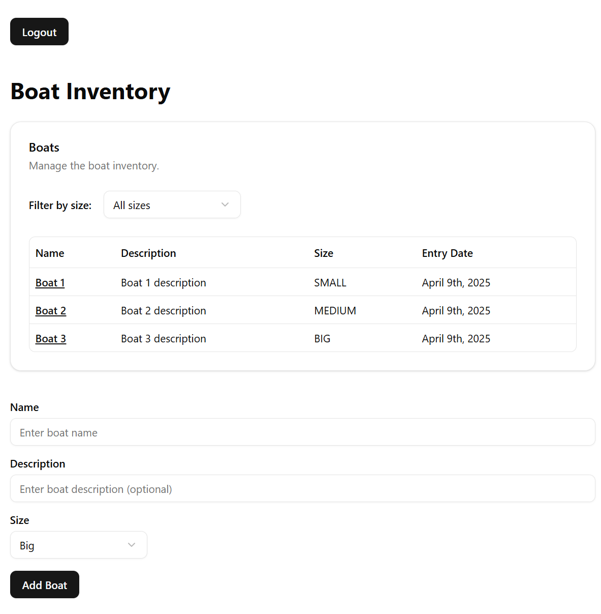

# Boat management system - frontend

## Description
Frontend project for boat management system based on the latest React (19) and Next.js (15) versions and the modern UI and form management libraries. 

## Prerequisites
* Node.js 18.18 or later.

## Demo
https://owt-boat-slavalus-projects.vercel.app/

## How to run 
* npm install
* npm run dev

## Module list
* shadcn/ui and tailwind for design system
* react hook form for form management
* zod for validation
* jest for testing

## Limitations
Production version would contain visual feedback on page navigation and buttons clicks. 
To keep the development withing the reasonable limits this was avoided here. 

## Caveats
The React ecosystem is very dynamic and evolves rapidly. 
Libraries such as shadcn/ui and jest need to continuously adapt to new features. 
When running the project in development mode, you may encounter warnings, including deprecation warnings. 
These do not affect the application's functionality but should be addressed before moving to production. 

Due to async nature of Server components Next.js team recommends _using End-to-End Testing over Unit Testing_.
I have set up a unit testing libraries with a single demo test to demonstrate how it works. Production version would require
consideration on what we cover in unit tests and what in end-to-end tests.  
More info: https://nextjs.org/docs/app/building-your-application/testing

